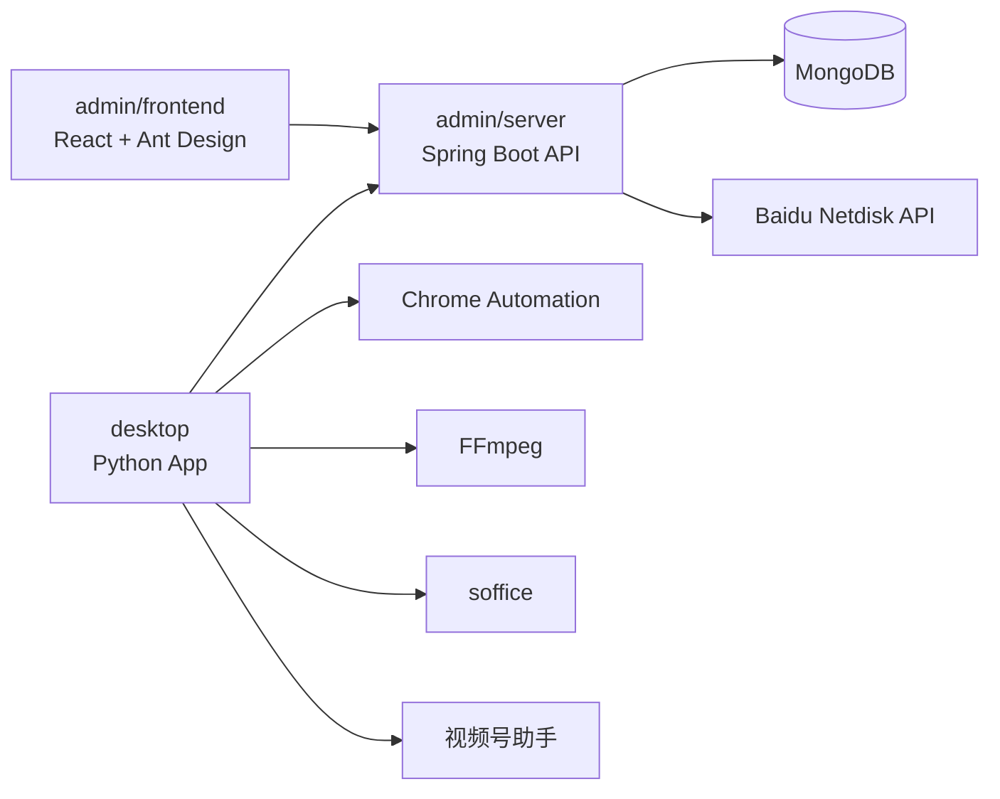
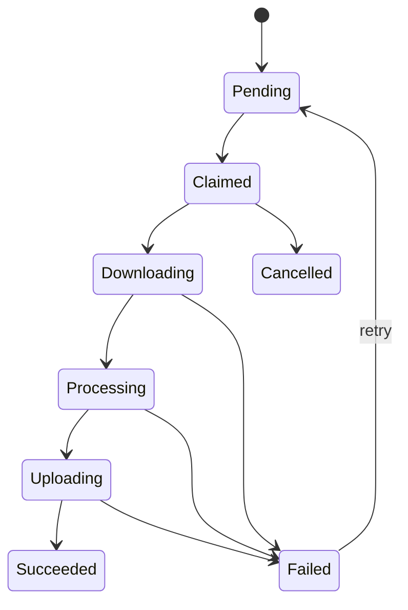

# 短剧分发系统技术文档

## 1. 总体架构

系统采用后台服务、后台管理界面、桌面端三部分协作：



## 2. 后端设计

### 2.1 技术栈

- Java 21
- Spring Boot 3
- Spring Security
- JWT
- Spring Data MongoDB
- springdoc-openapi
- Maven

### 2.2 分层

后端按领域而不是纯技术层堆叠：

- `auth`: 登录、JWT 签发、当前用户。
- `users`: 后台账号和桌面端用户。
- `categories`: 短剧类别。
- `configs`: 系统配置和敏感配置。
- `dramas`: 短剧、剧集、封面和云盘元数据。
- `media`: 媒体号、平台登录态、分发策略。
- `distribution`: 分发任务、任务锁、状态回传。
- `baiduyun`: 百度云扫描、下载链接解析、目录同步。
- `common`: 安全、异常、响应、配置。

### 2.3 数据模型

#### Account

- `id`
- `username`
- `passwordHash`
- `roles`
- `enabled`
- `createdAt`
- `lastLoginAt`

#### DramaCategory

- `id`
- `name`
- `code`
- `enabled`
- `sortOrder`

#### SystemConfig

- `id`
- `key`
- `value`
- `secret`
- `updatedAt`

敏感字段带 `secret` 标记，后台接口返回时脱敏；本地开发会从已有百度云配置文件导入数据库，生产环境可在 `SystemConfigService` 后追加 KMS/主密钥加密适配。

#### Drama

- `id`
- `title`
- `summary`
- `coverUrl`
- `categoryIds`
- `source`
- `sourcePath`
- `status`
- `episodeCount`
- `episodes`
- `createdAt`
- `updatedAt`

#### DramaEpisode

- `episodeNo`
- `title`
- `sourcePath`
- `fsId`
- `size`
- `downloadUrlExpiresAt`

#### MediaAccount

- `id`
- `ownerAccountId`
- `platform`
- `displayName`
- `status`
- `loginStateRef`
- `deviceId`
- `lastVerifiedAt`
- `distributionPolicy`

#### DistributionPolicy

- `categoryIds`
- `dailyLimit`
- `intervalMinutes`
- `enabled`
- `transcodePreset`

#### DistributionTask

- `id`
- `mediaAccountId`
- `dramaId`
- `episodeRange`
- `status`
- `lockedByDeviceId`
- `progress`
- `failureReason`
- `platformPublishId`
- `createdAt`
- `updatedAt`

### 2.4 API 风格

- 统一前缀：`/api/admin` 和 `/api/desktop`。
- 统一响应：`ApiResponse<T>`。
- 全局异常：`GlobalExceptionHandler`。
- 认证：`Authorization: Bearer <token>`。
- 管理后台和桌面端共用账号体系，后续可以拆分角色。

### 2.5 错误处理

异常分为：

- 参数错误：`400`
- 未认证：`401`
- 无权限：`403`
- 资源不存在：`404`
- 业务冲突：`409`
- 外部服务错误：`502`
- 系统错误：`500`

响应包含 `code`、`message`、`traceId` 和可选 `details`。

### 2.6 百度云集成

后端已接入真实百度网盘开放接口：

- `BaiduPanHttpClient`: 刷新 access token、列目录、获取文件元信息、生成带授权参数的真实下载链接。
- `BaiduDramaScanner`: 根据配置扫描最新日期目录并写入短剧库。
- `BaiduDramaImportPlanner`: 解析固定目录格式，识别剧名、集数、封面和分集顺序。
- `DramaCategoryClassifier`: 根据剧名和简介自动归类，分类结果写入短剧。

默认扫描根目录为 `/drama/真人剧/2026`。后端会选择该目录下最新的中文日期目录，例如 `6月13日`，再同步该日期目录内的短剧。已有 Python 示例保留在 `admin/server/docs/baiduyun`，用于对照真实 API 行为。

### 2.7 分发生成

`DistributionService` 根据媒体号策略生成任务：

- 媒体号必须为 `ACTIVE`。
- 分发策略必须启用。
- 短剧必须为 `READY` 且存在分集。
- 媒体号选择的类别与短剧自动分类匹配。
- 已为同一媒体号和短剧创建过任务时不会重复生成。

后台可通过 `POST /api/admin/distribution-tasks/generate` 手动生成任务，桌面端通过 `/api/desktop/tasks/claim` 拉取。

## 3. 前端设计

### 3.1 技术栈

- React 18
- TypeScript
- Vite
- Ant Design
- React Router
- Axios

### 3.2 目录结构

- `src/app`: 应用入口、路由、布局、Provider。
- `src/features`: 按业务模块组织页面和 API。
- `src/components`: 跨模块组件。
- `src/shared`: HTTP 客户端、错误处理、类型、存储。
- `src/styles`: 全局样式。

### 3.3 全局能力

- Axios 实例统一设置 base URL、Token、错误拦截。
- `ErrorBoundary` 捕获渲染错误。
- 路由守卫检查登录态。
- 页面异常通过 Ant Design `App` message/notification 呈现。

## 4. 桌面端设计

### 4.1 技术栈

- Python 3.11+
- httpx
- pydantic
- typer
- Playwright 或 Selenium 驱动 Chrome
- FFmpeg
- soffice

### 4.2 分层

- `api`: 后端 API 客户端。
- `auth`: 登录和本地令牌。
- `browser`: Chrome 探测、profile 管理、自动化控制。
- `video`: FFmpeg 转码。
- `platforms`: 平台发布适配器。
- `tasks`: 任务拉取、状态机和进度回传。
- `ui`: 桌面 UI 入口，第一阶段提供 CLI 和可扩展 GUI 边界。

### 4.3 平台发布端口

平台发布实现统一接口：

- `open_login()`
- `is_logged_in()`
- `export_login_state()`
- `publish(task, media_files)`

当前实现：

- `WeChatVideoPublisher`: 视频号，使用本机 Chrome profile 和 Playwright 做真实页面自动化上传、填写标题/简介并点击发布。
- `DouyinPublisher`: 预留。
- `TikTokPublisher`: 预留。

### 4.4 常用命令

```bash
aidrama-desktop login
aidrama-desktop categories
aidrama-desktop bind-wechat-video
aidrama-desktop agent
aidrama-desktop open-media --platform WECHAT_VIDEO
aidrama-desktop media-accounts
aidrama-desktop set-policy <mediaAccountId> --category-ids "romance,urban" --daily-limit 3 --interval-minutes 120
aidrama-desktop publish
aidrama-desktop download-drama <dramaId>
aidrama-desktop run-once
```

后台媒体号页面的“打开浏览器”按钮依赖桌面端本地代理。先在本机运行 `aidrama-desktop agent`，后台会请求 `http://127.0.0.1:17888/open-media?platform=WECHAT_VIDEO`，由桌面端打开独立 Chrome profile 并恢复该平台登录态。

## 5. 端到端状态机



## 6. 质量要求

- 后端关键业务服务必须有单元测试。
- 前端 HTTP、错误边界、认证路由要有清晰抽象。
- 桌面端外部命令调用必须集中封装，不在业务流程中散落 `subprocess`。
- 平台自动化脚本必须通过接口隔离页面细节，便于根据真实页面变化迭代。
